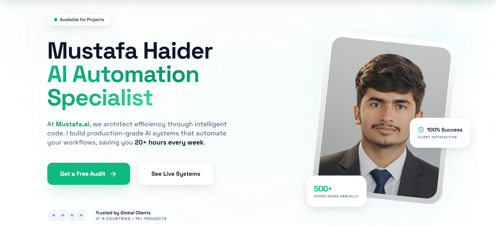

# Hi there, I'm Mustafa Haider 👋
### AI Automation Specialist | Backend & Web Scraping Expert

  

---

### 🚀 About Me
I architect efficiency through intelligent code. As an 
**AI Automation Architect & Backend Engineer** focus on designing high-performance systems that bridge the gap between fragmented tools and unified, high-speed business engines. I specialize in scaling operations through intelligent code and bespoke AI ecosystems.

- 🤖 **Currently focused on**: Advanced n8n & Make.com workflows, RAG-based AI agents, and high-scale web intelligence.
- 🛠️ **Expertise**: Automating lead ecosystems, voice AI integrations, and complex data synchronization.
- 📈 **Track Record**: 8+ global projects delivered, Top Rated on Upwork with 100% Job Success Score, $5K+ earned.
- 🤖 **Currently focused on**: Engineering self-adaptive web intelligence engines and production-grade RAG pipelines at EUmatrix.eu (Brussels).
- 🛠️ **Expertise**: Architecting complex n8n/Make.com workflows, multi-vector bot bypass systems, and end-to-end data synchronization.
- 📈 **Track Record**: 8+ global projects delivered, Top Rated on Upwork (100% Job Success), $5K+ earned. Most production code is under NDA (Belgian & Romanian law) — happy to live-share on a call.

---

### 🛠️ Tech Stack & Skills

| Category | Tools & Technologies |
| :--- | :--- |
| **Automation** |    |
| **Scraping** |     |
| **Backend & Data** |     |
| **AI & LLMs** |    |
| **Web Dev** |    |

---

### 🌟 Featured Projects

#### 🕵️‍♂️ Autonomous Web Intelligence Engine — *EUmatrix.eu*
*Covering 800+ European political/government domains with multi-vector bot bypass.*
- **Tech**: Google Cloud, Python, FastAPI, n8n, Playwright, Scrapy, Supabase.
- **Result**: 24/7 monitoring of EU policy & legislative sources with minimal manual intervention.
- *Private repo under NDA — available for live walkthrough.*

#### 🔄 Dynamic Record Hub
*End-to-end enterprise record management and synchronization.*
- **Tech**: Make.com, Airtable, REST APIs.
- **Result**: Eliminated 20+ hours of manual data entry weekly.

---

### 📊 GitHub Stats

---

### 📩 Let's Connect!
I'm always open to discussing new projects, technical challenges, or the future of AI.

- 💼 **LinkedIn**: [Mustafa Haider](https://www.linkedin.com/in/mustafa-haider-034152176/)
- 🚀 **Upwork**: [Work with me](https://www.upwork.com/freelancers/~01e19bb071ea911c71)
- 💬 **WhatsApp**: [Chat Now](https://wa.me/923485872275)
- 📧 **Email**: [mustafahaider758@gmail.com](mailto:mustafahaider758@gmail.com)

 
Built with precision by Mustafa Haider • © 2026

